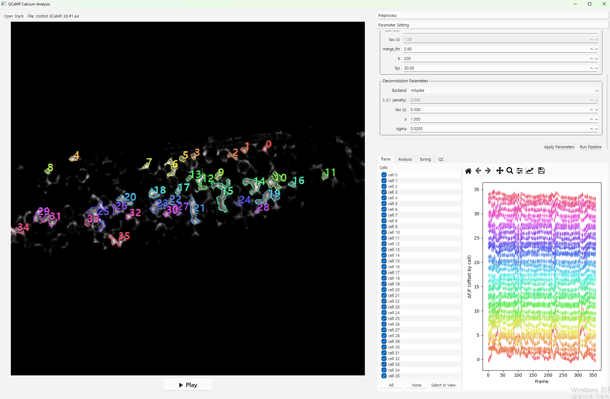

# GCaMP Image Analyse (GUI)

A lightweight GUI pipeline for GCaMP calcium imaging: **preprocessing → segmentation → trace extraction / deconvolution → reporting**.  
Designed to run on Windows/macOS/Linux and to **gracefully degrade** when optional scientific stacks are missing.

---

<p align="center">
  
</p>

---

## Why two environments?

This project ships (and expects) **two separate Conda environments**:

- **`gcamp_gui_environment.yml`** — main GUI & baseline analysis stack *(Qt, NumPy, optional SciPy/scikit-image, Suite2p integration, plotting, I/O)*  
- **`caiman_environment.yml`** — **CaImAn (CNMF-E)** stack

**Reason.** Heavy scientific packages (Suite2p, CaImAn, NumPy/Numba, OpenCV/ffmpeg, BLAS/MKL) often require **different, conflicting binary builds**. Keeping CaImAn in the same environment frequently causes installation failures or runtime DLL errors. Splitting environments **avoids dependency conflicts** and keeps the GUI env small & stable.

> 🔁 The GUI runs in **`gcamp-gui`**. When you request CNMF-E, the app invokes CaImAn via `conda run -n caiman …` for you.

---

## Installation

1. Install **Conda/Mamba** (Miniconda or Mambaforge recommended).
2. Create the two environments from the YAML files in the project root:

```bash
# main GUI environment
conda env create -f gcamp_gui_environment.yml -n gcamp-gui
```

```bash
# CaImAn (CNMF-E) environment
conda env create -f caiman_environment.yml -n caiman
```

---

## Running the app

```bash
conda activate gcamp-gui
cd .GCaMP_Image_Analyze
python -m gcamp_gui.app
```

That’s it—this opens the GUI. CNMF-E (if you choose the **`cnmf`** backend) runs via the separate **`caiman`** environment.

---

## Features (high-level)

- **Preprocess**: photobleaching removal, denoising *(Gaussian/median/mean/wavelet/BM3D\*)*, motion correction *(rigid FFT phase correlation)*  
- **Segmentation**: Suite2p *(spawned in a subprocess)*, CaImAn CNMF-E *(runs in `caiman` env)*, or a minimal **threshold** fallback  
- **Signals**: neuropil subtraction, baseline estimation, **ΔF/F**, deconvolution via **OASIS** *(safe AR(1) fallback)* or **MLSpike** *(multi-tier fallbacks)*  
- **I/O**: TIFF/NPY/AVI/MP4 input; project bundling *(YAML meta + NPZ arrays)*; CSV/NWB export  
- **Visualization**: image view with ROI overlays, stacked traces + optional spike markers, correlation views, and a basic report

\* Optional components auto-fallback when the dependency isn’t installed.

> ⚠️ **Tuning / QC are work-in-progress.** They are included in the UI for preview but **not yet fully functional**.

---

## Backends

- `suite2p` — recommended default; runs headless in a child process  
- `cnmf` — CaImAn CNMF-E; requires the `caiman` environment  
- `threshold` — minimal fallback (fast, few dependencies)
- `oasis` — OASIS deconvolution (fast, FOOPSI-based). Uses an efficient constrained deconvolution (L1 sparsity penalty λ) and is a good default for large datasets and interactive use.
- `mlspike` — MLSpike model-based deconvolution. Uses a generative biophysical model (parameters like tau, a, sigma); can give more accurate spike timing when tuned, but is typically slower and may require parameter estimation for best results.

---

## Basic workflow

1. Load your movie *(TIFF/NPY/AVI/MP4)*  
2. *(Optional)* Adjust preprocessing *(brightness/contrast preview, crop, bleaching, denoise, motion correction)*  
3. Run segmentation *(Suite2p / CNMF-E / threshold)*  
4. Extract ROI & neuropil traces → **ΔF/F** → deconvolution  
5. Inspect traces, overlays, and quick analysis  
6. Export CSV / project bundle / quick report

---

## Attribution & prior art

Parts of this codebase were **inspired by or adapted from**:

- **detect** by N. S. Desai — <https://github.com/nsdesai/detect>

---

## Known limitations

- **Tuning / QC**: present in the UI but **under development**; behavior may change  
- Best portability when exporting envs with:

```bash
conda env export --no-builds > environment.yml
```

- Some optional features depend on **SciPy / scikit-image / tifffile**; without them the app falls back to simpler methods

---

## Troubleshooting

- **“Access is denied” when exporting YAML on Windows**  
  Quote the path if it contains spaces:

  ```bat
  conda env export --no-builds > ".\gcamp_gui\environment.yml"
  ```

- **Qt plugin errors** — Ensure the app is launched **inside** the `gcamp-gui` environment.  
- **CaImAn import errors** — Verify the separate `caiman` environment exists and is discoverable by `conda run`.

---

## License

This project uses multiple third-party packages (Suite2p, CaImAn, OASIS, etc.).  
Please consult and comply with each project’s license when distributing or modifying derived components.

---

## One-line recap

> Use **two Conda envs** (to avoid dependency conflicts), activate **`gcamp-gui`**, then  
> `cd .GCAMP_IMAGE_ANALYSE && python -m gcamp_gui.app` to launch.  
> **Tuning / QC are not yet functional.**
